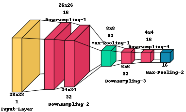
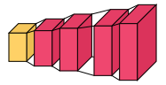
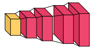

# visualkeras for Keras / TensorFlow

[](https://pypi.python.org/pypi/visualkeras)
[](https://pypi.python.org/pypi/visualkeras)

## Introduction
Visualkeras is a Python package to help visualize Keras (either standalone or included in tensorflow) neural network architectures. It allows easy styling to fit most 
needs. This module supports layered style architecture generation which is great for CNNs (Convolutional Neural 
Networks), and a graph style architecture, which works great for most models including plain feed-forward networks.
For help in citing this project, refer [here](#citation-header).

## Model Support

|  Mode | Sequential  |  Functional |  Subclassed models |
|---|---|---|---|
| `visualkeras.layered_view()` | yes<sup>(1)</sup> | partially<sup>(1,2)</sup> |  not tested |
| `visualkeras.graph_view()` | yes | yes |  not tested |

<sup>1</sup>: Any tensor with more than 3 dimensions will be rendered as 3D tensor with elongated z-axis.

<sup>2</sup>: Only linear models where each layer has no more than one in or output. Non-linear models will be shown in sequential order.

## Version Support

We currently only support Keras versions 2 and above. We plan to add support for Keras version 1 in the coming updates.

## Installation
To install published releases from PyPi (last updated: June 30, 2024) execute:
```bash
pip install visualkeras
```
To update visualkeras to the latest version, add the `--upgrade` flag to the above commands.

If you want the latest (potentially unstable) features you can also directly install from the github master branch:
```bash
pip install git+https://github.com/paulgavrikov/visualkeras
```

## Usage

Generating neural network architectures is easy:
```python
import visualkeras

model = ...

visualkeras.layered_view(model).show() # display using your system viewer
visualkeras.layered_view(model, to_file='output.png') # write to disk
visualkeras.layered_view(model, to_file='output.png').show() # write and show
```

To help understand some of the most important parameters we are going to use a VGG16 CNN architecture (see [example.py](examples/vgg16.py)).

###### Default
```python
visualkeras.layered_view(model)
```


###### Legend

You can set the legend parameter to describe the relationship between color and layer types. It is also possible to pass
a custom `PIL.ImageFont` to use (or just leave it out and visualkeras will use the default PIL font). Please note that 
you may need to provide the full path of the desired font depending on your OS.

```python
from PIL import ImageFont

font = ImageFont.truetype("arial.ttf", 32)  # using comic sans is strictly prohibited!
visualkeras.layered_view(model, legend=True, font=font)  # font is optional!
```


###### Flat Style
```python
visualkeras.layered_view(model, draw_volume=False)
```


###### Spacing and logic grouping
The global distance between two layers can be controlled with `spacing`. To generate logical groups a special dummy 
keras layer `visualkeras.SpacingDummyLayer()` can be added.
```python

model = ...
...
model.add(visualkeras.SpacingDummyLayer(spacing=100))
...

visualkeras.layered_view(model, spacing=0)
```


###### Custom color map
It is possible to provide a custom color map for fill and outline per layer type.
```python
from tensorflow.python.keras.layers import Dense, Conv2D, Flatten, Dropout, MaxPooling2D, ZeroPadding2D
from collections import defaultdict

color_map = defaultdict(dict)
color_map[Conv2D]['fill'] = 'orange'
color_map[ZeroPadding2D]['fill'] = 'gray'
color_map[Dropout]['fill'] = 'pink'
color_map[MaxPooling2D]['fill'] = 'red'
color_map[Dense]['fill'] = 'green'
color_map[Flatten]['fill'] = 'teal'

visualkeras.layered_view(model, color_map=color_map)
```


###### Hiding layers
Some models may consist of too many layers to visualize or to comprehend the model. In this case it can be helpful to 
hide (ignore) certain layers of the keras model without modifying it. Visualkeras allows ignoring layers by their type
 (`type_ignore`) or index in the keras layer sequence (`index_ignore`).
```python
visualkeras.layered_view(model, type_ignore=[ZeroPadding2D, Dropout, Flatten])
```


###### Scaling dimensions
Visualkeras computes the size of each layer by the output shape. Values are transformed into pixels. Then, scaling is 
applied. By default visualkeras will enlarge the x and y dimension and reduce the size of the z dimensions as this has 
deemed visually most appealing. However, it is possible to control scaling using `scale_xy` and `scale_z`. Additionally, 
to prevent to small or large options minimum and maximum values can be set (`min_xy`, `min_z`, `max_xy`, `max_z`).  
```python
visualkeras.layered_view(model, scale_xy=1, scale_z=1, max_z=1000)
```

_Note: Scaled models may hide the true complexity of a layer, but are visually more appealing._


###### Drawing information text 
With the `text_callable` argument a function can be passed to the `layered_view` function which can be used to draw text below or above a specific layer. The function should have to following properties:

- Accepts two arguments: First the index of the layer in the model. This index ignores layers listed in `type_ignore`, `index_ignore` and also ignores layers of class `SpacingDummyLayer`. The second arguments is the layer object used in the model at the index given in the first argument

- Returns two arguments: The first return value is a string containing the text to be drawn. The second return value is a bool value indicating if the text is to be drawn above the box representing the layer.

The following function aims to describe the names of layers and their dimensionality. It would produce the output shown in the figure below:
```python
def text_callable(layer_index, layer):
    # Every other piece of text is drawn above the layer, the first one below
    above = bool(layer_index%2)

    # Get the output shape of the layer
    output_shape = [x for x in list(layer.output_shape) if x is not None]

    # If the output shape is a list of tuples, we only take the first one
    if isinstance(output_shape[0], tuple):
        output_shape = list(output_shape[0])
        output_shape = [x for x in output_shape if x is not None]

    # Variable to store text which will be drawn    
    output_shape_txt = ""

    # Create a string representation of the output shape
    for ii in range(len(output_shape)):
        output_shape_txt += str(output_shape[ii])
        if ii < len(output_shape) - 2: # Add an x between dimensions, e.g. 3x3
            output_shape_txt += "x"
        if ii == len(output_shape) - 2: # Add a newline between the last two dimensions, e.g. 3x3 \n 64
            output_shape_txt += "\n"

    # Add the name of the layer to the text, as a new line
    output_shape_txt += f"\n{layer.name}"

    # Return the text value and if it should be drawn above the layer
    return output_shape_txt, above
```


_Note: Use the `padding` argument to avoid long text being cut off at the left or right edge of the image. Also use `SpacingDummyLayers` to avoid interleaving text of different layers._


###### Reversed view
In certain use cases, it may be useful to reverse the view of the architecture so we look at the back of each layer. For example, when visualizing a decoder-like architecture. In such cases, we can switch draw_reversed to True. The following two figures show the same model with draw_reversed set to False and True, respectively.

```python
visualkeras.layered_view(model, draw_reversed=False) # Default behavior
```


```python
visualkeras.layered_view(model, draw_reversed=True)
```


###### Show layer dimensions (in the legend)
It is possible to display layer dimensions in the legend. To do so, set `legend=True` and `show_dimension=True` in `layered_view`. This is a simpler alternative to creating a callable for the `text_callable` argument to display dimensions above or below each layer.

```python
visualkeras.layered_view(model, legend=True, show_dimension=True)
```


## FAQ

###### Feature X documented here does not work
The main branch may be ahead of pypi. Consider upgrading to the latest (perhaps unstable) build as discussed in _Installation_. 

###### Installing aggdraw fails
This is most likely due to missing gcc / g++ components (e.g. on Elementary OS). Try installing them via your package 
manager, e.g.:
```bash
sudo apt-get install gcc
sudo apt-get install g++
```

###### .show() doesn't open a window

You have probably not configured your default image viewer. You can install imagemagick via most package managers:
```bash
sudo apt-get install imagemagick
```

<h2 id="citation-header"> Citation </h2>

If you find this project helpful for your research please consider citing it in your publication as follows.
```
@misc{Gavrikov2020VisualKeras,
  author = {Gavrikov, Paul},
  title = {visualkeras},
  year = {2020},
  publisher = {GitHub},
  journal = {GitHub repository},
  howpublished = {\url{https://github.com/paulgavrikov/visualkeras}},
}
```
