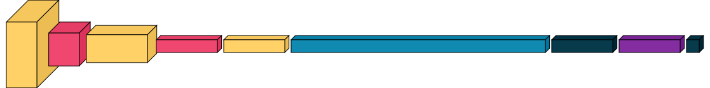
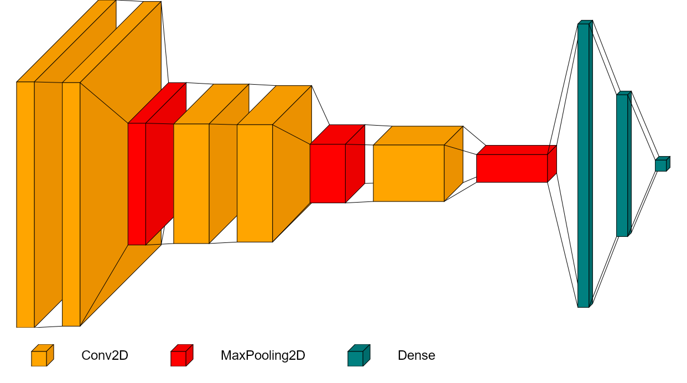
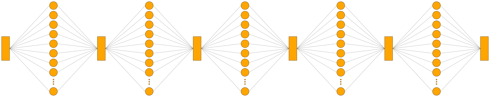
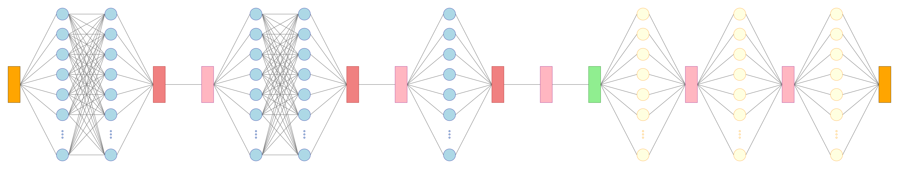

# Summary

visualkeras is a Python package designed to facilitate the visualization of Keras and TensorFlow models. It provides an intuitive developer interface for generating visual representations of model architectures, making it easier for researchers and developers to understand and communicate their designs. The package supports layered volumetric views in 2D / 3D space and directed node-edge graph-based layouts. When provided with a functional or sequential Keras model, visualkeras can generate a highly customizable visualization through various parameters such as color, spacing, dynamic sizing modes, legends, dimensionality, textual annotations, orientation, and more.

# Statement of Need

The visualization of Artificial Intelligence (AI) and Machine Learning (ML) models plays a crucial role for understanding and communicating their architecture. The effectiveness of such visualizations plays a key role in the scientific process. Although detailed descriptions of model architectures and mathematics are often provided in research papers, architectural diagrams are essential for conveying complex structures and relationships in a more accessible manner.

The Keras package [@Chollet2015] provides a high-level API for building and training deep learning models. Keras and its underlying framework, TensorFlow [@Abadi2016], have been widely adopted in the AI and ML community . However, the built-in visualization tools in Keras are primitive and do not provide the flexibility needed for proper architectural representation. Images generated using Keras's built-in visualization tools require significant effort for readers to understand and are simply not suitable for scientific publication or communication purposes. visualkeras addresses this gap by providing a comprehensive set of tools for visualizing Keras models in a way that is both informative and visually appealing.

# Key Features
visualkeras offers a range of visualization features and customization options. The framework is split into two main components.

## Layered View
This component is designed to render both sequential and functional models using a pseudo‑3D stacked box layout in a single continuous view. Each box visually represents a layer, with its width, height, and depth corresponding to the layer’s spatial and channel dimensions under one of five sizing modes (`accurate`, `balanced`, `capped`, `logarithmic`, `relative`). 

Rendering options can be toggled between three-dimensional (volumetric) and two-dimensional (flat) modes via the `draw_volume` parameter. Funnel-style connectors can be displayed between boxes using `draw_funnel`, and `shade_step` controls the deviation in lightness to improve depth perception. Logical spacing can be introduced through special "dummy" layers (`SpacingDummyLayer`) which are incorporated into the model object itself. Users may add custom annotations to each box via a `text_callable` function, which can be further customized with vertical offset adjustments provided by `text_vspacing`. A flexible `color_map` parameter allows users to color boxes based on layer type or user-defined attributes.

Layout control is further refined by adjusting `spacing` (inter-layer gaps), `padding` (margins at the beginning and end), and orientation settings. One-dimensional layers can be oriented using `one_dim_orientation`, and individual layers can be constrained to 2D rendering via `index_2D`. An entire model can be rendered flat by disabling volumetric rendering. Support for better visualizing decoder-like architectures is available through the `draw_reversed` option.

A configurable legend can be added, with options for adjusting text spacing (`legend_text_spacing_offset`), font properties (`font`, `font_color`), and whether to show dimensions at each layer (`show_dimension`). Finally, users can control scaling across the x-y plane and z-axis using `scale_xy` and `scale_z`. These dimensions can be explicitly capped or floored using `max_xy`, `max_z`, `min_xy`, and `min_z` parameters.

The final visualization is produced as a Pillow `Image` object [@Clark2015], which can be displayed in Jupyter notebooks or saved to disk.

## Graph View
This component generates a left-to-right node-edge visualization of any `Keras` or `tf.keras` model by treating each layer (or individual  neuron) as a node and drawing directed connectors to represent data flow. Given a `Model` instance, the function computes a hierarchy of layers based on their graph depth, places nodes evenly spaced in horizontal layers, and centers them vertically within the image canvas. Each node is drawn as a fixed-size circle or box (specified by `node_size`), and may represent the entire layer or each neuron it contains, depending on the `show_neurons` parameter.

Connectors between nodes are rendered as lines whose color and thickness can be controlled through the `connector_fill` and `connector_width` arguments. Layout parameters such as `layer_spacing`, `node_spacing`, `padding`, and `background_fill` allow users to adjust the overall compactness, margins, and canvas appearance. For models with a large number of neurons in a layer, the `ellipsize_after` parameter can be used to replace excess nodes with an ellipsis symbol to prevent overcrowding. The `inout_as_tensor` option determines whether each tensor input or output is showns as a single tensor (rectangular shape) or expanded into multiple units.

Node coloring is fully customizable via the `color_map` parameter which maps layer classes to fill and outline colors. This allows for visually distinguishing different layer types.

Like the Layered View, the Graph View produces a Pillow `Image` object [@Clark2015] that can be displayed in Jupyter notebooks or saved to disk.

# Usage Examples
/*In this section, we provide examples of how to use visualkeras to visualize Keras models in different ways. The examples shown in Figure 1, Figure 2, Figure 3, and Figure 4 demonstrate the flexibility and customization options available in the package. The generated graphical visualizations can be displayed in Jupyter notebooks or saved as image files for use in publications or presentations.*/

In this section, we provide examples of Keras model visualizations that were generated using visualkeras. The examples shown in Figure 1, Figure 2, Figure 3, and Figure 4 demonstrate the flexibility and customization options available in the package. Code snippets used to generate these examples are written in the visualkeras GitHub repository's [usage_examples.md file](https://github.com/paulgavrikov/visualkeras/blob/master/examples/usage_examples.md). Generated graphical visualizations can be displayed inline in Jupyter notebooks or saved as image files for use in publications or presentations.

## Layered View

### Basic Usage

### Advanced Usage

## Graph View

### Basic Usage

### Advanced Usage

# Acknowledgements
We thanks and acknowledge the contributions of the open-source community which has supported the development of visualkeras over the years through their feature requests, ideas, bug reports, issue discussions, and pull requests.  These contributions have allowed us to continuously improve the package and adapt it to the needs of the community. We are grateful for the collaborative spirit that has made visualkeras a valuable tool for visualizing Keras and TensorFlow models.

Namely, we thank Alejandro Lorenzo, Erik Schultheis, Alessio G. Monti, Willy Fitra Hendria [@Hendria2024], Krzysztof Mizgała, Cosmin M. Marina, Martin Kubovčík, and others who have contributed to the project through their feedback and contributions.

# References
